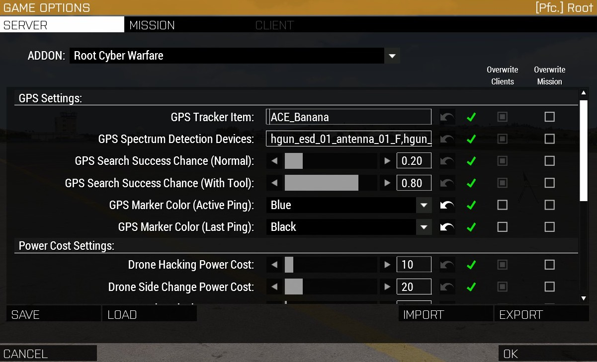

# Configuration

Complete reference for all CBA settings in Root's Cyber Warfare.

## Table of Contents

- [Overview](#overview)
- [Accessing CBA Settings](#accessing-cba-settings)
- [Power Cost Settings](#power-cost-settings)
- [GPS Settings](#gps-settings)
- [Configuration Best Practices](#configuration-best-practices)
- [Mission Parameter Overrides](#mission-parameter-overrides)

---

## Overview

Root's Cyber Warfare uses **CBA (Community Base Addons) Settings** for runtime configuration. All settings can be adjusted:
- **In-game**: Via CBA Settings menu
- **Server config**: Via server.cfg or mission parameters
- **Mission script**: Via script commands

**Total Settings:** 10
- **Power Cost Settings:** 5 settings
- **GPS Settings:** 5 settings

---

## Accessing CBA Settings

### In-Game (Client)

1. **Main Menu:**
   - Main Menu → Options → Addon Options → Root's Cyber Warfare

2. **In-Game (ESC Menu):**
   - ESC → Addon Options → Root's Cyber Warfare

### Categories

Settings are organized into categories:
- **GPS Settings** - GPS tracker configuration and detection
- **Power Cost Settings** - Energy costs for hacking operations



---

## Power Cost Settings

All power costs are measured in **Watt-hours (Wh)**.

### 1. Door Lock/Unlock Cost

**Setting Name:** `ROOT_CYBERWARFARE_DOOR_COST`

**Type:** Slider

**Range:** 1-50 Wh

**Default:** 2 Wh

**Description:** Power cost to lock or unlock a single door.

**Affects:**
- `door <BuildingID> <DoorID> lock`
- `door <BuildingID> <DoorID> unlock`
- `door <BuildingID> a lock` (multiplied by number of doors)
- `door <BuildingID> a unlock` (multiplied by number of doors)

**Balance Considerations:**
- **Low (1-3 Wh)**: Easy door manipulation, encourages frequent use
- **Medium (4-10 Wh)**: Tactical decision-making required
- **High (11-50 Wh)**: Significant investment, rare use

**Access in Script:**
```sqf
private _doorCost = missionNamespace getVariable ["ROOT_CYBERWARFARE_DOOR_COST", 2];
```

---

### 2. Drone Hacking Cost (Disable)

**Setting Name:** `ROOT_CYBERWARFARE_DRONE_HACK_COST`

**Type:** Slider

**Range:** 1-100 Wh

**Default:** 10 Wh

**Description:** Power cost to disable (destroy/explode) a drone.

**Affects:**
- `disabledrone <DroneID>`
- `disabledrone a` (multiplied by number of drones)

**Balance Considerations:**
- **Low (1-10 Wh)**: Drones are easy to disable
- **Medium (11-30 Wh)**: Moderate cost, tactical choice
- **High (31-100 Wh)**: Expensive, reserved for critical targets

**Access in Script:**
```sqf
private _droneCost = missionNamespace getVariable ["ROOT_CYBERWARFARE_DRONE_HACK_COST", 10];
```

---

### 3. Drone Side Change Cost

**Setting Name:** `ROOT_CYBERWARFARE_DRONE_SIDE_COST`

**Type:** Slider

**Range:** 1-100 Wh

**Default:** 20 Wh

**Description:** Power cost to change a drone's faction/side.

**Affects:**
- `changedrone <DroneID> <west|east|guer|civ>`
- `changedrone a <faction>` (multiplied by number of drones)

**Balance Considerations:**
- **Low (1-15 Wh)**: Frequent faction changes possible
- **Medium (16-40 Wh)**: Strategic decision, convert high-value drones
- **High (41-100 Wh)**: Rare use, major tactical impact

**Note:** Generally higher than disable cost because changing faction is more powerful (gain asset vs. just destroy).

**Access in Script:**
```sqf
private _droneSideCost = missionNamespace getVariable ["ROOT_CYBERWARFARE_DRONE_SIDE_COST", 20];
```

---

### 4. Custom Device Cost

**Setting Name:** `ROOT_CYBERWARFARE_CUSTOM_COST`

**Type:** Slider

**Range:** 1-100 Wh

**Default:** 10 Wh

**Description:** Power cost to activate or deactivate a custom scripted device.

**Affects:**
- `custom <CustomID> activate`
- `custom <CustomID> deactivate`

**Balance Considerations:**
- **Low (1-10 Wh)**: Encourages experimentation with custom devices
- **Medium (11-30 Wh)**: Moderate cost for scripted effects
- **High (31-100 Wh)**: Reserved for powerful custom devices

**Note:** Mission makers can override this per device during registration.

**Access in Script:**
```sqf
private _customCost = missionNamespace getVariable ["ROOT_CYBERWARFARE_CUSTOM_COST", 10];
```

---

### 5. Power Grid Control Cost

**Setting Name:** `ROOT_CYBERWARFARE_POWERGRID_COST`

**Type:** Slider

**Range:** 1-100 Wh

**Default:** 15 Wh

**Description:** Power cost to control a power generator (on/off/overload).

**Affects:**
- `powergrid <GridID> on`
- `powergrid <GridID> off`
- `powergrid <GridID> overload`

**Balance Considerations:**
- **Low (1-10 Wh)**: Frequent blackouts possible
- **Medium (11-30 Wh)**: Tactical lighting control
- **High (31-100 Wh)**: Rare use, mission-critical events

**Note:** Mission makers can override this per generator during registration.

**Access in Script:**
```sqf
private _powerGridCost = missionNamespace getVariable ["ROOT_CYBERWARFARE_POWERGRID_COST", 15];
```

---

## GPS Settings

### 6. GPS Tracker Device

**Setting Name:** `ROOT_CYBERWARFARE_GPS_TRACKER_DEVICE`

**Type:** Text Box (EDITBOX)

**Default:** `ACE_Banana`

**Description:** Classname of the item used as a GPS tracker for manual attachment.

**Affects:**
- ACE self-interaction menu: "Attach GPS Tracker"
- Physical GPS tracker placement by players

**Common Values:**
- `ACE_Banana` (default, humorous placeholder)
- `ItemGPS` (vanilla GPS)
- Custom item classname

**How It Works:**
Players carrying this item in their inventory can attach GPS trackers to themselves or others via ACE interaction menu.

**Configuration Example:**
```
ACE_Banana
```

**Access in Script:**
```sqf
private _trackerClass = missionNamespace getVariable ["ROOT_CYBERWARFARE_GPS_TRACKER_DEVICE", "ACE_Banana"];
```

**Custom Item Setup:**
If using a custom item, ensure:
1. Item exists in the mission/mod
2. Item is available in player inventories
3. Classname is spelled correctly (case-sensitive)

---

### 7. GPS Detection Devices (Spectrum Devices)

**Setting Name:** `ROOT_CYBERWARFARE_GPS_SPECTRUM_DEVICES`

**Type:** Text Box (EDITBOX)

**Default:**
```
hgun_esd_01_antenna_01_F,hgun_esd_01_antenna_02_F,hgun_esd_01_antenna_03_F,hgun_esd_01_base_F,hgun_esd_01_dummy_F,hgun_esd_01_F
```

**Description:** Comma-separated list of ESD (Electronic Spectrum Device) classnames that improve GPS tracker detection chance.

**Affects:**
- GPS tracker search success chance
- If player has one of these devices, uses higher success chance (see Setting #9)
- If player has none, uses normal success chance (see Setting #8)

**How It Works:**
When searching for GPS trackers on objects:
1. Check if player has any item from this list
2. If yes: Use "GPS Search Success Chance (With Tool)"
3. If no: Use "GPS Search Success Chance (Normal)"

**Configuration Example:**
```
hgun_esd_01_antenna_01_F,hgun_esd_01_antenna_02_F,hgun_esd_01_F
```

**Custom Devices:**
Add custom detection devices by appending classnames:
```
hgun_esd_01_F,MyCustomDetector_F,AnotherDetector_F
```

**Access in Script:**
```sqf
private _devicesString = missionNamespace getVariable ["ROOT_CYBERWARFARE_GPS_SPECTRUM_DEVICES", ""];
private _deviceClasses = _devicesString splitString ",";
```

---

### 8. GPS Search Success Chance (Normal)

**Setting Name:** `ROOT_CYBERWARFARE_GPS_SEARCH_CHANCE_NORMAL`

**Type:** Slider

**Range:** 0.01-1.0 (1%-100%)

**Default:** 0.2 (20%)

**Decimal Places:** 2

**Description:** Probability of successfully finding a GPS tracker when searching WITHOUT a spectrum detection device.

**Affects:**
- ACE interaction: "Search for GPS Tracker" on objects
- Success rate when player has no ESD tool

**Balance Considerations:**
- **Very Low (0.01-0.1)**: GPS trackers very hard to find, realistic
- **Low (0.11-0.3)**: Moderate challenge, encourages tool use
- **Medium (0.31-0.6)**: Reasonable success without tools
- **High (0.61-1.0)**: Easy to find, trackers less stealthy

**Recommended:** 0.2 (20%) - Encourages using ESD tools while allowing some luck

**Access in Script:**
```sqf
private _normalChance = missionNamespace getVariable ["ROOT_CYBERWARFARE_GPS_SEARCH_CHANCE_NORMAL", 0.2];
```

---

### 9. GPS Search Success Chance (With Tool)

**Setting Name:** `ROOT_CYBERWARFARE_GPS_SEARCH_CHANCE_TOOL`

**Type:** Slider

**Range:** 0.01-1.0 (1%-100%)

**Default:** 0.8 (80%)

**Decimal Places:** 2

**Description:** Probability of successfully finding a GPS tracker when searching WITH a spectrum detection device.

**Affects:**
- ACE interaction: "Search for GPS Tracker" on objects
- Success rate when player has ESD tool (from Setting #7)

**Balance Considerations:**
- **Low (0.01-0.4)**: ESD tools provide minimal advantage
- **Medium (0.41-0.7)**: Moderate improvement, still some uncertainty
- **High (0.71-0.95)**: Significant advantage, reliable detection
- **Very High (0.96-1.0)**: Near-guaranteed detection, trivializes counter-surveillance

**Recommended:** 0.8 (80%) - Strong advantage for having the tool, but not guaranteed

**Tool Advantage:**
```
Default: 80% with tool vs 20% without tool = 4x improvement
```

**Access in Script:**
```sqf
private _toolChance = missionNamespace getVariable ["ROOT_CYBERWARFARE_GPS_SEARCH_CHANCE_TOOL", 0.8];
```

---

### 10. GPS Marker Color (Active Ping)

**Setting Name:** `ROOT_CYBERWARFARE_GPS_MARKER_ROOT_CYBERWARFARE_COLOR_ACTIVE`

**Type:** List (Dropdown)

**Options:**
- ColorBlack
- ColorGrey
- ColorRed (default)
- ColorBrown
- ColorOrange
- ColorYellow
- ColorKhaki
- ColorGreen
- ColorBlue
- ColorPink
- ColorWhite
- ColorWEST (BLUFOR blue)
- ColorEAST (OPFOR red)
- ColorGUER (Independent green)
- ColorCIV (Civilian purple)
- ColorUNKNOWN (Grey)

**Default:** ColorRed

**Description:** Color of the map marker that shows the actively tracked GPS target (updates at configured frequency).

**Affects:**
- Active ping marker during GPS tracking
- Visible while tracking is active

**Visual Reference:**
- **ColorRed**: Bright red, high visibility, danger indication
- **ColorBlue**: BLUFOR blue, faction association
- **ColorGreen**: Independent green, neutral target
- **ColorOrange**: High visibility, alert color
- **ColorYellow**: Warning color, moderate visibility

**Recommended:**
- **Enemies**: ColorRed (danger, hostile)
- **Friendlies**: ColorWEST/ColorBlue (allied)
- **Neutrals**: ColorYellow/ColorOrange (caution)

**Access in Script:**
```sqf
private _activeColor = missionNamespace getVariable ["ROOT_CYBERWARFARE_GPS_MARKER_ROOT_CYBERWARFARE_COLOR_ACTIVE", "ColorRed"];
```

---

### 11. GPS Marker Color (Last Ping)

**Setting Name:** `ROOT_CYBERWARFARE_GPS_MARKER_ROOT_CYBERWARFARE_COLOR_LASTPING`

**Type:** List (Dropdown)

**Options:** Same as Active Ping (Setting #10)

**Default:** ColorUNKNOWN (Grey)

**Description:** Color of the map marker that shows the last known position after GPS tracking ends.

**Affects:**
- Last ping marker after tracking completes
- Remains visible for configured duration (per tracker)

**Visual Reference:**
- **ColorUNKNOWN (Grey)**: Faded, historical data
- **ColorOrange**: Still somewhat relevant, recent
- **ColorYellow**: Caution, outdated position

**Recommended:**
- ColorUNKNOWN (grey) - Clearly distinguishes from active ping
- ColorYellow - Indicates "stale but recent" information

**Best Practice:**
Use a different color from Active Ping to clearly distinguish:
- Active Ping: ColorRed (current position, danger)
- Last Ping: ColorUNKNOWN (old position, uncertain)

**Access in Script:**
```sqf
private _lastPingColor = missionNamespace getVariable ["ROOT_CYBERWARFARE_GPS_MARKER_ROOT_CYBERWARFARE_COLOR_LASTPING", "ColorUNKNOWN"];
```

---

## Configuration Best Practices

### 1. Balance Power Costs for Mission Type

**Stealth Missions:**
```
Door Cost: 2-5 Wh (frequent use expected)
Drone Disable: 15-20 Wh (avoid noise)
Drone Side Change: 30-40 Wh (stealth focus)
```

**Action Missions:**
```
Door Cost: 1-3 Wh (fast pace)
Drone Disable: 5-10 Wh (frequent combat)
Drone Side Change: 10-15 Wh (tactical variety)
```

**Realism/Hardcore:**
```
Door Cost: 10-20 Wh (significant investment)
Drone Disable: 30-50 Wh (rare capability)
Drone Side Change: 50-100 Wh (major operation)
```

---

### 2. GPS Detection Balance

**Easy Detection (Training/Casual):**
```
Normal Chance: 0.5 (50%)
Tool Chance: 0.9 (90%)
```

**Balanced Detection (Standard):**
```
Normal Chance: 0.2 (20%)
Tool Chance: 0.8 (80%)
```

**Hard Detection (Realistic/Competitive):**
```
Normal Chance: 0.05 (5%)
Tool Chance: 0.4 (40%)
```

---

### 3. Marker Color Schemes

**Faction-Based:**
```
Active Ping: ColorEAST (OPFOR red)
Last Ping: ColorUNKNOWN (Grey)
```

**Visibility-Based:**
```
Active Ping: ColorRed (high visibility)
Last Ping: ColorYellow (moderate visibility)
```

**Status-Based:**
```
Active Ping: ColorGreen (active/valid)
Last Ping: ColorOrange (stale/uncertain)
```

---

### 4. Server Configuration

For dedicated servers, set defaults in server config or mission parameters.

**Example: server.cfg**
```cpp
// Note: CBA settings are typically configured in mission files or userconfig,
// not server.cfg. Use mission parameters instead.
```

---

## Mission Parameter Overrides

### Scripted Override (Mission Start)

Override CBA settings via script in `initServer.sqf`:

```sqf
// Override power costs
missionNamespace setVariable ["ROOT_CYBERWARFARE_DOOR_COST", 5, true];
missionNamespace setVariable ["ROOT_CYBERWARFARE_DRONE_HACK_COST", 15, true];
missionNamespace setVariable ["ROOT_CYBERWARFARE_DRONE_SIDE_COST", 30, true];
missionNamespace setVariable ["ROOT_CYBERWARFARE_CUSTOM_COST", 20, true];
missionNamespace setVariable ["ROOT_CYBERWARFARE_POWERGRID_COST", 25, true];

// Override GPS settings
missionNamespace setVariable ["ROOT_CYBERWARFARE_GPS_TRACKER_DEVICE", "ItemGPS", true];
missionNamespace setVariable ["ROOT_CYBERWARFARE_GPS_SEARCH_CHANCE_NORMAL", 0.3, true];
missionNamespace setVariable ["ROOT_CYBERWARFARE_GPS_SEARCH_CHANCE_TOOL", 0.9, true];
missionNamespace setVariable ["ROOT_CYBERWARFARE_GPS_MARKER_ROOT_CYBERWARFARE_COLOR_ACTIVE", "ColorOrange", true];
missionNamespace setVariable ["ROOT_CYBERWARFARE_GPS_MARKER_ROOT_CYBERWARFARE_COLOR_LASTPING", "ColorYellow", true];
```

**Note:** Overrides apply only to current mission session.

---

### Dynamic Adjustment (Mid-Mission)

Adjust settings during mission for dynamic difficulty:

```sqf
// Increase difficulty after 30 minutes
[] spawn {
    sleep 1800; // 30 minutes

    // Double all power costs
    private _doorCost = missionNamespace getVariable ["ROOT_CYBERWARFARE_DOOR_COST", 2];
    missionNamespace setVariable ["ROOT_CYBERWARFARE_DOOR_COST", _doorCost * 2, true];

    private _droneCost = missionNamespace getVariable ["ROOT_CYBERWARFARE_DRONE_HACK_COST", 10];
    missionNamespace setVariable ["ROOT_CYBERWARFARE_DRONE_HACK_COST", _droneCost * 2, true];

    hint "Cyber warfare systems becoming more expensive due to increased security.";
};
```

---

### Conditional Configuration (Event-Based)

Adjust based on mission events:

```sqf
// Reduce costs after completing objective
"IntelObjective" call BIS_fnc_taskCompleted;

if ("IntelObjective" call BIS_fnc_taskCompleted) then {
    // Halve door costs after intel gathered
    private _doorCost = missionNamespace getVariable ["ROOT_CYBERWARFARE_DOOR_COST", 2];
    missionNamespace setVariable ["ROOT_CYBERWARFARE_DOOR_COST", _doorCost / 2, true];

    hint "Access codes acquired - door hacking now easier!";
};
```

---

### Difficulty Presets

Create difficulty presets for easy mission setup:

```sqf
// fn_setCyberwarfareDifficulty.sqf
params [["_difficulty", "normal", [""]]];

switch (_difficulty) do {
    case "easy": {
        missionNamespace setVariable ["ROOT_CYBERWARFARE_DOOR_COST", 1, true];
        missionNamespace setVariable ["ROOT_CYBERWARFARE_DRONE_HACK_COST", 5, true];
        missionNamespace setVariable ["ROOT_CYBERWARFARE_DRONE_SIDE_COST", 10, true];
        missionNamespace setVariable ["ROOT_CYBERWARFARE_CUSTOM_COST", 5, true];
        missionNamespace setVariable ["ROOT_CYBERWARFARE_POWERGRID_COST", 10, true];
        missionNamespace setVariable ["ROOT_CYBERWARFARE_GPS_SEARCH_CHANCE_NORMAL", 0.5, true];
        missionNamespace setVariable ["ROOT_CYBERWARFARE_GPS_SEARCH_CHANCE_TOOL", 0.95, true];
    };

    case "normal": {
        // Use defaults (already set by CBA)
    };

    case "hard": {
        missionNamespace setVariable ["ROOT_CYBERWARFARE_DOOR_COST", 10, true];
        missionNamespace setVariable ["ROOT_CYBERWARFARE_DRONE_HACK_COST", 30, true];
        missionNamespace setVariable ["ROOT_CYBERWARFARE_DRONE_SIDE_COST", 50, true];
        missionNamespace setVariable ["ROOT_CYBERWARFARE_CUSTOM_COST", 30, true];
        missionNamespace setVariable ["ROOT_CYBERWARFARE_POWERGRID_COST", 40, true];
        missionNamespace setVariable ["ROOT_CYBERWARFARE_GPS_SEARCH_CHANCE_NORMAL", 0.05, true];
        missionNamespace setVariable ["ROOT_CYBERWARFARE_GPS_SEARCH_CHANCE_TOOL", 0.3, true];
    };
};

// Usage in initServer.sqf:
["hard"] call compile preprocessFileLineNumbers "fn_setCyberwarfareDifficulty.sqf";
```

---

**For gameplay impact, see [Player Guide](Player-Guide). For implementation details, see [Architecture](Architecture).**
