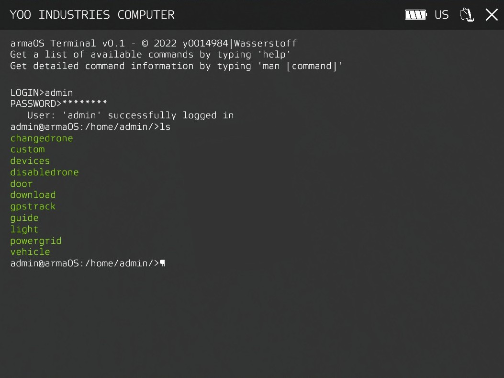

# Player Guide

This guide covers everything players need to know about using Root's Cyber Warfare to hack and control devices in Arma 3.

## Table of Contents

- [Getting Started](#getting-started)
- [Terminal Commands](#terminal-commands)
- [Power Management](#power-management)
- [GPS Tracker Mechanics](#gps-tracker-mechanics)
- [Tips and Tricks](#tips-and-tricks)

## Getting Started

### Accessing the Terminal

1. Approach an AE3 laptop (black, olive, or sand colored laptop objects)
2. Open the ACE interaction menu:
   - Press **Windows key** (default) or
   - Use **ACE Self-Interact** key (default: Ctrl+Windows)
3. Select **Access Terminal**
4. The terminal interface will open, showing the ArmaOS command line

### Prerequisites

The laptop must have **hacking tools installed** by a Zeus curator or mission maker. You can verify this by typing `ls /` and checking for the tools directory (usually `/rubberducky/tools` or similar).

### Basic Navigation

Once in the terminal, you can use standard ArmaOS commands:
- `ls` - List files and directories
- `cd <directory>` - Change directory
- `cat <file>` - View file contents
- `help` - View available commands

The hacking tools add specialized commands for device control.



## Terminal Commands

### Getting Help

All commands support built-in help documentation. To view detailed syntax, available actions, and examples for any command:

**Syntax:**
```bash
<command> help
<command> -h
<command> --help
```

**Examples:**
```bash
devices help       # Show all device types and usage
door help          # Show door command syntax with examples
vehicle help       # Show all vehicle actions (battery, speed, brakes, etc.)
powergrid help     # Show power grid control options
gpstrack help      # Show GPS tracking command details
```

**What Help Includes:**
- Command description and purpose
- Complete syntax with required/optional parameters
- Available actions and their values
- Multiple usage examples
- Important notes and warnings
- Power consumption requirements

All help text is color-coded:
- **Green** - Command titles and headers
- **Yellow** - Section labels (Description, Syntax, Examples)
- **Cyan** - Parameter names and key terms
- **Red** - Warnings for destructive operations
- **White** - Regular explanatory text

### 1. devices - List Accessible Devices

**Syntax:**
```bash
devices [type] [deviceId]
```

**Description:**
Lists all devices you have access to hack. Optionally filter by device type. When a device ID is provided, shows detailed information for that specific device.

**Type Filters:**
- `doors` - Show only doors/buildings
- `lights` - Show only lights
- `drones` - Show only drones/UAVs
- `files` - Show only downloadable files
- `custom` - Show only custom devices
- `gps` - Show only GPS trackers
- `vehicles` - Show only vehicles
- `powergrids` - Show only power generators
- `all` or `a` - Show all devices (default)

**Examples (Summary View):**
```bash
devices              # List all accessible devices (summary)
devices doors        # List only doors (summary: ID, name, location)
devices vehicles     # List only vehicles (summary: ID, name, location)
devices a            # List all devices (summary)
```

**Examples (Detailed View):**
```bash
devices doors 1234      # Show detailed door information for building 1234
devices vehicles 5678   # Show all hackable features for vehicle 5678
devices drones 9101     # Show detailed drone status and faction
devices gps 1122        # Show GPS tracker status and location history
devices powergrids 3344 # Show affected lights in power grid 3344
```

**Output Format:**

**Summary View** (no device ID provided):
- **Doors**: `<Building ID> - <Building Name> - <Grid Location>` with aggregate lock status (Locked/Unlocked/Partially Locked)
- **Lights**: `<Light ID> - <Building Name> - <Grid Location>`
- **Drones**: `<Drone ID> - <Drone Name> - <Grid Location>`
- **Files**: `<File ID> - <File Name> - <Download Time>`
- **Custom**: `<Device ID> - <Device Name> - <Grid Location>`
- **GPS Trackers**: `<Tracker ID> - <Tracker Name> - <Grid Location>`
- **Vehicles**: `<Vehicle ID> - <Vehicle Name> - <Grid Location>`
- **Power Grids**: `<Grid ID> - <Grid Name> - <Grid Location>`

**Detailed View** (device ID provided):
- **Doors**: Individual door IDs with lock status (Locked/Unlocked) and state (Open/Closed)
- **Lights**: Individual light IDs with status (ON/OFF)
- **Drones**: Faction (color-coded), display name, grid location, status
- **Files**: File name, size, estimated transfer time, file content
- **Custom**: Device information and status (if supported)
- **GPS Trackers**: Track time, update frequency, power cost, status, last position
- **Vehicles**: Hackable features with allowed/not allowed indicators, current vehicle status (fuel, engine, lights, damage)
- **Power Grids**: Radius, state (ON/OFF), count of affected lights with their IDs

**Color Coding:**
Device status information is color-coded for quick identification:
- **Green** - Active, On, Unlocked, Allowed, or Tracking
- **Red** - Inactive, Off, Locked, Not Allowed, or Failed
- **Yellow** - Partially Locked or Completed
- **Blue** - BLUFOR faction or Untracked (available)
- **Purple** - Civilian faction
- **Dark Red** - OPFOR faction (drones)

---

### 2. door - Control Building Doors

**Syntax:**
```bash
door <BuildingID> <DoorID|'a'> <lock|unlock>
```

**Description:**
Lock or unlock doors in registered buildings.

**Parameters:**
- `BuildingID` - The unique ID of the building (from `devices doors`)
- `DoorID` - Specific door ID, or `a` to target all doors
- `lock|unlock` - Desired door state

**Power Cost:** Configurable (default: **2 Wh per door**)

**Examples:**
```bash
door 1454 2881 lock      # Lock door 2881 in building 1454
door 1454 2881 unlock    # Unlock door 2881 in building 1454
door 1454 a lock         # Lock ALL doors in building 1454
door 1454 a unlock       # Unlock ALL doors in building 1454
```

**Confirmation Required:** Yes (for multiple doors when using `a`)

**Notes:**
- Doors marked as "unbreachable" cannot be opened with ACE explosives or lockpicking
- Locking a door does not automatically close it
- Door state (open/closed) is shown in `devices doors` output

---

### 3. light - Control Lights

**Syntax:**
```bash
light <LightID|'a'> <off|on>
```

**Description:**
Turn lights on or off.

**Parameters:**
- `LightID` - The unique ID of the light (from `devices lights`), or `a` to target all lights
- `off|on` - Desired light state

**Power Cost:** Included in CBA settings

**Examples:**
```bash
light 3 off         # Turn off light 3
light 3 on          # Turn on light 3
light a off         # Turn off ALL accessible lights
light a on          # Turn on ALL accessible lights
```

**Confirmation Required:** Yes (when using `a` for multiple lights)

**Notes:**
- Lights include both building lights and street lamps
- Light state changes are visible to all players
- Some lights may be controlled by power generators instead

---

### 4. changedrone - Change Drone Faction

**Syntax:**
```bash
changedrone <DroneID|'a'> <west|east|guer|civ>
```

**Description:**
Change the faction/side of a drone or UAV.

**Parameters:**
- `DroneID` - The unique ID of the drone (from `devices drones`), or `a` to target all drones
- `west|east|guer|civ` - Desired faction
  - `west` - NATO/BLUFOR
  - `east` - OPFOR
  - `guer` - Independent/AAF
  - `civ` - Civilian

**Power Cost:** Configurable (default: **20 Wh per drone**)

**Examples:**
```bash
changedrone 2 east     # Change drone 2 to OPFOR
changedrone 2 west     # Change drone 2 to NATO
changedrone a civ      # Change ALL drones to Civilian
```

**Confirmation Required:** Yes

**Notes:**
- Changing faction transfers control to that side
- Drones will engage targets based on their new faction
- Dead or destroyed drones cannot have their faction changed
- Current drone faction is shown in `devices drones` output (color-coded)

---

### 5. disabledrone - Disable Drones

**Syntax:**
```bash
disabledrone <DroneID|'a'>
```

**Description:**
Disable (destroy/explode) a drone or UAV.

**Parameters:**
- `DroneID` - The unique ID of the drone (from `devices drones`), or `a` to target all drones

**Power Cost:** Configurable (default: **10 Wh per drone**)

**Examples:**
```bash
disabledrone 2        # Disable drone 2
disabledrone a        # Disable ALL accessible drones
```

**Confirmation Required:** Yes

**Notes:**
- Disabling a drone causes it to explode and become destroyed
- This is a permanent, irreversible action
- Already destroyed drones will show an error message

---

### 6. download - Download Files

**Syntax:**
```bash
download <FileID>
```

**Description:**
Download a file from a database to the laptop's Downloads folder.

**Parameters:**
- `FileID` - The unique ID of the file (from `devices files`)

**Power Cost:** Time-based (depends on file size in seconds)

**Examples:**
```bash
download 1234        # Download file 1234
```

**Confirmation Required:** No

**Notes:**
- Download time equals the file's configured size (in seconds)
- Files are saved to `/home/user/Downloads/<filename>` on the laptop
- Use `cat /home/user/Downloads/<filename>` to view downloaded files
- Some files execute code automatically upon download completion
- Download progress is shown in the terminal


---

### 7. custom - Control Custom Devices

**Syntax:**
```bash
custom <CustomID> <activate|deactivate>
```

**Description:**
Activate or deactivate custom scripted devices.

**Parameters:**
- `CustomID` - The unique ID of the custom device (from `devices custom`)
- `activate|deactivate` - Desired device state

**Power Cost:** Configurable (default: **10 Wh per action**)

**Examples:**
```bash
custom 5 activate      # Activate custom device 5
custom 5 deactivate    # Deactivate custom device 5
```

**Confirmation Required:** Yes

**Notes:**
- Custom devices execute mission-maker-defined SQF code
- Effects depend entirely on the device's programmed behavior
- Examples: alarm systems, generator control, door mechanisms, scripted events

---

### 8. gpstrack - Track GPS Devices

**Syntax:**
```bash
gpstrack <TrackerID>
```

**Description:**
Track a GPS-tagged object in real-time, showing its position on the map.

**Parameters:**
- `TrackerID` - The unique ID of the GPS tracker (from `devices gps`)

**Power Cost:** Per tracker (configurable, default: **2-10 Wh**)

**Examples:**
```bash
gpstrack 2421         # Track GPS device 2421
```

**Confirmation Required:** Yes

**Notes:**
- Tracking creates map markers visible to configured players/groups/sides
- **Active Ping** marker updates at the configured frequency (e.g., every 5 seconds)
- **Last Ping** marker shows the last known position after tracking ends
- Tracking duration and update frequency are set by the mission maker
- If "Allow Retracking" is enabled, you can track the same device again after completion
- Power is consumed at the start of tracking
- Tracking statuses: `Untracked`, `Tracking`, `Completed`, `Dead`, `Disabled`


See [GPS Tracker Mechanics](#gps-tracker-mechanics) for more details.

---

### 9. vehicle - Control Vehicles

**Syntax:**
```bash
vehicle <VehicleID> <action> <value>
```

**Description:**
Manipulate various vehicle parameters remotely.

**Parameters:**
- `VehicleID` - The unique ID of the vehicle (from `devices vehicles`)
- `action` - The parameter to modify
- `value` - The new value for the parameter

**Actions and Values:**

| Action | Value Range | Description |
|--------|-------------|-------------|
| `battery` | Configured Min-Max % | Set fuel/battery percentage (mission-maker configurable range, e.g., 0-100%) |
| `speed` | Configured Min-Max km/h | Adjust speed boost (supports negative for slowdown, e.g., -50 to 50 km/h) |
| `brakes` | Configured Min-Max m/s² | Apply brakes with deceleration rate (e.g., 1-10 m/s²) |
| `lights` | 0-1 | Toggle lights (subject to max toggle count and cooldown timer) |
| `engine` | 0-1 | Toggle engine (subject to max toggle count and cooldown timer) |
| `alarm` | Configured Min-Max seconds | Activate alarm for duration (e.g., 1-30 seconds) |

**Power Cost:** Per vehicle (configurable, default: **2 Wh per action**)

**Examples:**
```bash
vehicle 1337 battery 50    # Set fuel to 50% (if within allowed range)
vehicle 1337 battery 0     # Empty the tank (if min limit allows)
vehicle 1337 speed 30      # Boost speed by 30 km/h (if within allowed range)
vehicle 1337 speed -20     # Slow down by 20 km/h (if negative values allowed)
vehicle 1337 brakes 5      # Apply brakes at 5 m/s² deceleration (if within allowed range)
vehicle 1337 lights 0      # Toggle lights (if toggle limit not reached and cooldown expired)
vehicle 1337 engine 0      # Stop engine (if toggle limit not reached and cooldown expired)
vehicle 1337 alarm 10      # Activate alarm for 10 seconds (if within allowed range)
```

**Limit Violations:**
If you attempt an operation outside the configured limits, you'll receive an error message:

- **Fuel/Battery**: `Error! Fuel value 120% is outside allowed range [0% - 100%].`
- **Speed**: `Error! Speed value 80 km/h is outside allowed range [-50 - 50 km/h].`
- **Brakes**: `Error! Brake deceleration 15 m/s² is outside allowed range [1 - 10 m/s²].`
- **Lights Toggles**: `Error! Light toggle limit reached. Maximum: 5, Current count: 5.`
- **Lights Cooldown**: `Error! Light toggle on cooldown. Wait 3.5 seconds.`
- **Engine Toggles**: `Error! Engine toggle limit reached. Maximum: 3, Current count: 3.`
- **Engine Cooldown**: `Error! Engine toggle on cooldown. Wait 2.1 seconds.`
- **Alarm Duration**: `Error! Alarm duration 60 seconds is outside allowed range [1 - 30 seconds].`

**Confirmation Required:** Yes

**Notes:**
- Not all actions are available for all vehicles (depends on mission maker configuration)
- Check `devices vehicles` to see which features are enabled (e.g., "Battery, Speed, Lights, Engine")
- Each vehicle has configured min/max limits for operation values
- Operations outside these limits are rejected with error messages showing the allowed range
- Toggle operations (lights, engine) may have maximum usage counts and cooldown timers
- Toggle counters reset when the vehicle respawns
- Brakes now use configurable deceleration rates instead of simple on/off
- Speed values can be negative to slow down vehicles
- Error messages display current value and allowed range for debugging

---

### 10. powergrid - Control Power Generators

**Syntax:**
```bash
powergrid <GridID> <on|off|overload>
```

**Description:**
Control power generators that manage lights within a radius.

**Parameters:**
- `GridID` - The unique ID of the power grid (from `devices powergrids`)
- `on|off|overload` - Desired action

**Actions:**
- `on` - Turn on all lights within the generator's radius
- `off` - Turn off all lights within the generator's radius
- `overload` - Create explosion and destroy generator (if enabled by mission maker)

**Power Cost:** Configurable (default: **15 Wh per action**)

**Examples:**
```bash
powergrid 1234 on          # Turn on lights in radius
powergrid 1234 off         # Turn off lights in radius
powergrid 1234 overload    # Destroy generator and lights
```

**Confirmation Required:** Yes

**Notes:**
- Power grids control all lights within their configured radius
- Excluded light classnames (set by mission maker) are not affected
- **Overload** action may create an explosion if enabled (configurable explosion type)
- Overload permanently destroys the generator
- Number of affected lights is shown in the output

---

## Power Management

### Understanding Battery Consumption

Every hacking operation consumes power from the laptop's internal battery. The laptop uses **AE3's power system**, which measures battery capacity in **Kilowatt-hours (kWh)**.

Power costs for hacking operations are configured in **Watt-hours (Wh)**:
- 1 kWh = 1000 Wh
- Example: A laptop with 0.5 kWh battery has 500 Wh available

### Default Power Costs

| Operation | Default Cost (Wh) |
|-----------|-------------------|
| Lock/unlock door | 2 |
| Change drone faction | 20 |
| Disable drone | 10 |
| Custom device action | 10 |
| Power grid control | 15 |
| Vehicle action | 2 (configurable per vehicle) |
| GPS tracking | 2-10 (configurable per tracker) |
| Light control | Included in CBA settings |

All power costs can be adjusted via CBA settings (see [Configuration](Configuration)).

### Checking Battery Level

Use AE3's power management commands in the terminal:
```bash
battery              # Check current battery level
```

Or check the laptop's status indicator (if available in AE3).

### What Happens When Power Runs Out?

If you attempt an operation without sufficient power:
- You'll receive an error message: `Error! Insufficient Power!`
- The operation will **not** execute
- No power will be consumed
- You'll need to recharge or swap the battery

### Bulk Operation Costs

When using `a` to target multiple devices (e.g., `door 1234 a lock`), the total power cost is calculated **before** execution:
- **Total Cost = Single Cost × Number of Devices**
- Example: Locking 5 doors at 2 Wh each = **10 Wh total**
- You must have enough power for **all** devices, or the operation will fail

---

## GPS Tracker Mechanics

GPS trackers provide real-time position tracking of objects, vehicles, or players.

### How GPS Trackers Work

1. **Placement**: Mission makers or Zeus curators attach GPS trackers to objects
2. **Detection**: Players can physically search for trackers (see below)
3. **Tracking**: Use the `gpstrack <TrackerID>` command to activate tracking
4. **Visualization**: Map markers show the target's position

### Tracking Parameters

Each GPS tracker has configurable parameters:
- **Tracking Time**: How long tracking stays active (e.g., 60 seconds)
- **Update Frequency**: How often the position updates (e.g., every 5 seconds)
- **Power Cost**: Energy required to start tracking (e.g., 10 Wh)
- **Allow Retracking**: Whether you can track again after completion
- **Last Ping Duration**: How long the "last ping" marker remains visible

### Map Markers

Two types of markers are created:

1. **Active Ping Marker** (default: red)
   - Shows current position
   - Updates at the configured frequency
   - Disappears when tracking ends

2. **Last Ping Marker** (default: unknown/grey)
   - Shows the final known position
   - Remains for the configured duration after tracking ends
   - Helps locate the target even after tracking stops

Marker colors can be customized via CBA settings (see [Configuration](Configuration)).

### Physically Searching for GPS Trackers

Players can search for hidden GPS trackers on objects using ACE interactions:

1. Approach the object (vehicle, person, etc.)
2. Open **ACE Interaction Menu** on the object
3. Look for **GPS Tracker Detection** options (if available)


#### Using ESD (Electronic Spectrum Device) Tools

Detection success chance is higher when holding spectrum detection devices:
- **Normal detection chance**: 20% (default, configurable)
- **With ESD tool**: 80% (default, configurable)


Default ESD devices (configurable in CBA settings):
- `hgun_esd_01_antenna_01_F`
- `hgun_esd_01_antenna_02_F`
- `hgun_esd_01_antenna_03_F`
- `hgun_esd_01_base_F`
- `hgun_esd_01_F`


### Attaching GPS Trackers (Player Action)

If you have a GPS tracker item in your inventory (default: `ACE_Banana`, configurable):

1. Open **ACE Self-Interaction Menu**
2. Navigate to **Equipment** → **Attach GPS Tracker**
3. This attaches a tracker to yourself


Mission makers can configure which item acts as the GPS tracker (see [Configuration](Configuration)).

### Disabling GPS Trackers

Once discovered, GPS trackers can be disabled:
- Use ACE interaction on the tracker
- This prevents further tracking of that device

---

## Tips and Tricks

### 1. Use Bulk Operations Efficiently

When controlling multiple devices of the same type, use `a`:
```bash
door 1234 a unlock       # Unlock all doors in building
light a off              # Turn off all accessible lights
changedrone a civ        # Change all drones to civilian
```

**Tip**: The confirmation prompt shows how many devices will be affected and the total power cost. This helps avoid mistakes!

### 2. Check Power Before Major Operations

Before attempting bulk operations or expensive hacks:
```bash
battery                  # Check current power level
```

If power is low, consider:
- Swapping batteries (via AE3 interaction)
- Charging the laptop (if power sources available)
- Prioritizing critical targets

### 3. Use Device Listing Filters

Instead of scrolling through all devices, filter by type:
```bash
devices vehicles         # Only show vehicles
devices gps              # Only show GPS trackers
```

This is especially useful in missions with many hackable objects.

### 4. Read Confirmation Prompts Carefully

Confirmation prompts show:
- How many devices will be affected
- Total power cost
- 10-second timeout

**Example:**
```
This will affect 12 doors and consume 24 Wh.
Continue? (Y/N) [10s timeout]
```

Press `Y` to confirm, `N` to cancel. If you don't respond within 10 seconds, the operation is cancelled.

### 5. Monitor GPS Tracker Status

Check `devices gps` to see tracker statuses:
- **Untracked**: Ready to track
- **Tracking**: Currently active
- **Completed**: Tracking finished (can retrack if allowed)
- **Dead**: Target is destroyed
- **Disabled**: Tracker was disabled physically

### 6. Coordinate with Team

GPS tracking map markers can be configured to show for:
- Specific players
- Groups
- Entire sides (BLUFOR, OPFOR, etc.)

Ask your Zeus or mission maker who can see the markers!

### 7. Vehicle Hacking Strategies

When hacking enemy vehicles:
1. **Immobilize**: Set `battery 0` and `engine 0`
2. **Blind**: Set `lights 0` (for night operations)
3. **Trap**: Set `brakes 0` (vehicle can't slow down)
4. **Disable**: Set `speed 0` (vehicle can't move)

### 8. Power Grid Tactics

Power grids are useful for:
- **Blackouts**: Turn off entire base lighting (`powergrid X off`)
- **Diversions**: Turn lights on/off to create distractions
- **Sabotage**: Overload to destroy generators (if enabled)

### 9. Custom Device Experimentation

Custom devices are mission-specific. Try activating them to discover their effects:
```bash
custom 5 activate
```

Common custom device types:
- Alarm systems
- Automated doors
- Generator controls
- Scripted events (reinforcements, objectives, etc.)

### 10. Error Messages are Helpful

If you see an error, it usually explains the problem:
- `Error! Insufficient Power!` → Recharge battery
- `Error! Invalid BuildingID` → Check the ID with `devices doors`
- `Access denied to Vehicle ID: 1234` → You don't have permission for that device
- `Drone already of side WEST` → Drone is already the faction you're trying to set

---

## Troubleshooting

### I can't access the terminal

- Ensure the laptop is an **AE3 laptop** (black/olive/sand colored)
- Verify **hacking tools are installed** (ask Zeus or check mission briefing)
- Make sure you're using the **ACE interaction menu**, not the vanilla action menu

### No devices appear when I type `devices`

- You may not have **access** to any devices
- Ask your Zeus curator to link devices to your laptop
- Check if devices were registered as "public" or "available to future laptops"

### "Access denied" errors

You don't have permission for that device. Devices can be:
- **Private**: Only specific laptops have access
- **Public**: All laptops have access
- **Future only**: Only laptops added after device registration

Contact your Zeus or mission maker to grant access.

### Insufficient power errors

Your battery is low. Options:
- **Swap battery**: Via AE3 interaction menu
- **Recharge**: Connect to a power source (if available)
- **Conserve power**: Perform only critical operations

### GPS tracking doesn't show markers

Check:
- **Marker visibility**: Ask if you're in the configured owner list (sides/groups/players)
- **Tracker status**: Use `devices gps` - it should say "Untracked" or "Tracking", not "Dead" or "Disabled"
- **Map open**: Ensure your map is open to see markers

### Doors won't unlock

- Check door lock status: `devices doors`
- If marked "unbreachable", hacking is the **only** way to open them
- Unlocking doesn't auto-open doors - press your "open door" key (Space by default)

---

**Need more help?** Check the [Zeus Guide](Zeus-Guide) or [Mission Maker Guide](Mission-Maker-Guide) for setup information, or visit the [GitHub Issues](https://github.com/A3-Root/Root_Cyberwarfare/issues) page to report bugs, or ask in [Discord](https://discord.gg/77th-jsoc-official).
